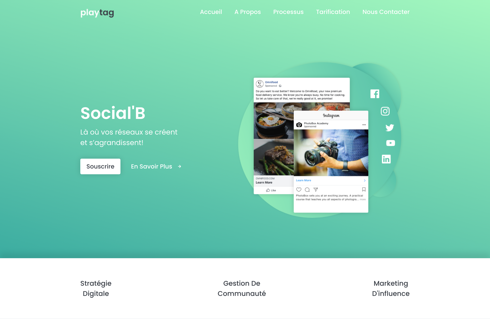

# Social-B

This is a landing page for Social'B. Social'B is a digital marketing agency that specializes in digital strategy, community management, and influencer marketing. Social-B fully manages your presence online and helps you establish your community on different platforms such as Facebook, Instagram, Twitter, LinkedIn, Viadeo, YouTube, Pinterest, and many more...

## Table of contents

- [Overview](#overview)
  - [The challenge](#the-challenge)
  - [Screenshot](#screenshot)
  - [Links](#links)
- [Process](#process)
  - [Built with](#built-with)
  - [What I learned](#what-i-learned)
  - [Continued development](#continued-development)
  - [Useful resources](#useful-resources)
- [Author](#author)

## Overview

### The challenge

Users should be able to:

- View the optimal layout depending on their device's screen size
- Navigate the page via a navigation menu
- Interact with interactive elements
  - See hover and focus states for interactive elements
  - Switch between interactive cards
  - Receive validation information while filling out a form

### Screenshot

### Links

- Repository URL: [https://github.com/jeanpierretouma/social-b](https://github.com/jeanpierretouma/social-b)
- Live Site URL: [https://jeanpierretouma.github.io/social-b](https://jeanpierretouma.github.io/social-b)

## Process

### Built with

- Semantic HTML5 markup
- Flexbox
- Grid
- jQuery

### What I learned

This project was a gig I worked on and it helped me get a glimpse of what it means to be a frontend developer or a web developer in general. I learned to collaborate with the business owner and ask questions to understand their needs and goals to set a plan to work on the project. I learned about the process of making a website from scratch. While designing and building this project I learned about the different stages that a designer and developer must go through to get to the final product with the best possible outcome that serves the users of the website and the business behind it.

### Continued development

I'm satisfied with the way I designed and built this project because it was my first gig and the client was happy with the end result. It looks quite close to the design which tackles all users challenges and it works well.

After some testing on different browsers and devices, I discovered that there is a bug in the navigation bar that, when the browser window width is where the mobile navigation is, if the closing button is clicked to hide the navigation links, the navigation links don't reappear when the browser window width increases to where the desktop navigation menu is.

Another feautre that I'll implement in this project is JS form validation to increase security and interactive of the contact form of the landing page.

### Useful resources

- [A Complete Guide to Grid](https://css-tricks.com/snippets/css/complete-guide-grid) - This article helped me understand the different ways to build layout with CSS Grid. I'd recommend it to people looks for different use cases of CSS Grid.

## Author

The content and design are copyrighted by the business owner of Social-B - PLAYTAG at [playtag.ai](https://playtag.ai). I was given permission to display this project on my GitHub profile as a portfolio.